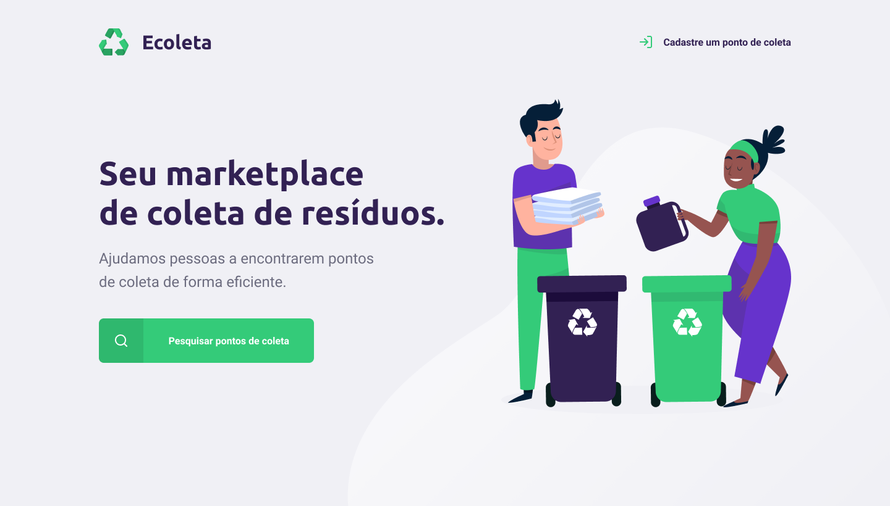

# 
>

<h1 style="color: #888" align="center">
    Ecoleta
</h1>

  
  
  
  

>

## 💻 Project

This project was developed in this international environment week. The propose is to connect companies to make a difference every day.

# 

>

## 🔖 Layout

To access the layout use [Figma](https://www.figma.com/file/1SxgOMojOB2zYT0Mdk28lB/).

>

## 🚀 Technologies

This project was developed with the following technologies:

- Node.js
- TypeScript
- React
- Express
- SQLite / Knex
- Leaflet

>

## ☁️  External API
The web and mobile project used an external API to load the states and cities of Brazil.

-  [IBGE](https://servicodados.ibge.gov.br/api/docs/localidades)

>

## 👊🏼 Contributing
You are totally allowed to contribute with this project. To do that, fork this repository, make your changes and create a pull request.

> >

<h4 align="center">
    Made by <a href="https://www.linkedin.com/in/figortmartins/" style="color: #00a0df" target="_blank">Igor Martins</a>
</h4>